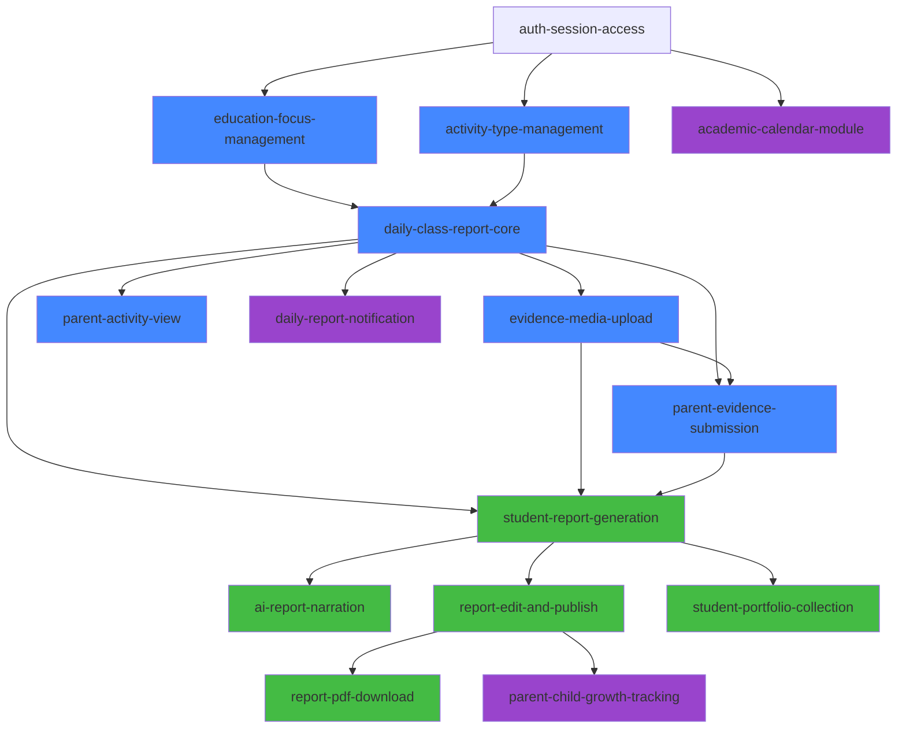

# PRD — Class Activity (Portal Guru & Portal Orang Tua)

## 1. Ringkasan Produk

Modul **Class Activity** adalah ekstensi dari Sistem Informasi Keuangan Sekolah yang menambahkan kapabilitas pencatatan aktivitas harian kelas, dokumentasi evidence pendidikan, dan pelaporan pencapaian siswa. Modul ini melayani dua portal utama:

- **Portal Guru (Facilitator)** — untuk mencatat aktivitas harian, evidence 4 fokus pendidikan, upload dokumentasi, dan generate report pencapaian siswa.
- **Portal Orang Tua** — untuk melihat laporan harian anak, menambahkan evidence/dokumentasi dari rumah, mengakses report pencapaian per kuarter, dan melihat kalender akademik.

### Tujuan

- Mendigitalisasi pencatatan aktivitas kelas yang sebelumnya manual
- Menyediakan transparansi aktivitas anak kepada orang tua secara real-time
- Menghasilkan report pencapaian siswa secara otomatis berbasis AI
- Mendukung pendekatan pendidikan holistik Iqrolife (4 Fokus Pendidikan)
- Mobile-friendly untuk kemudahan penggunaan di lapangan

### Konteks Integrasi

Modul ini ditambahkan ke repo yang sama (`keuangan`) sebagai module baru di backend dan halaman baru di frontend. Role **Guru** yang sudah ada di PRD keuangan adalah role yang sama dengan **Facilitator** — hanya beda sebutan sesuai konteks fitur.

---

## 2. Tech Stack Tambahan

### File Storage
- **Cloudinary** — untuk upload dan penyimpanan foto/dokumentasi evidence

### AI / LLM
- **Google Gemini API (REST)** — untuk generate narasi report pencapaian siswa berdasarkan data checklist dan evidence
- Panggilan ke Gemini menggunakan REST API langsung (bukan SDK)
- Konteks AI: memahami pendidikan fitrah dan pendidikan holistik Iqrolife

### Existing Stack (tidak berubah)
- Frontend: Vite + React + Tailwind CSS
- Backend: NestJS + TypeORM + PostgreSQL
- Integrasi: Gmail SMTP, Fonnte (WhatsApp)

---

## 3. User Roles (Ekstensi)

### Guru / Facilitator (role existing: `GURU`)

Hak akses tambahan:

- Mencatat aktivitas harian per kelas
- Mencentang checklist 4 fokus pendidikan per siswa
- Mengisi evidence dan upload dokumentasi per siswa
- Membuat catatan harian
- Generate report pencapaian siswa (3 bulanan & 6 bulanan)
- Melihat dan mengedit draft report sebelum publish
- Melihat kalender akademik

---

### Orang Tua (role existing: `PARENT`)

Hak akses tambahan:

- Melihat laporan aktivitas harian anak (per tanggal)
- Melihat evidence dan dokumentasi dari guru
- Menambahkan evidence/informasi tambahan tentang anak
- Upload dokumentasi dari rumah
- Mengunduh report pencapaian per kuarter (PDF)
- Memberikan feedback (redirect ke WhatsApp)
- Melihat kalender akademik
- Menerima notifikasi tagihan bulanan (portal dan WhatsApp) — sudah ada di modul keuangan

---

### Superadmin (role existing: `SUPERADMIN`)

Hak akses tambahan:

- Mengelola master data Fokus Pendidikan (CRUD)
- Mengelola master data Aktivitas Kelas (CRUD)
- Mengelola Kalender Akademik (CRUD)
- Mengelola template report pencapaian
- Konfigurasi AI report generation

---

## 4. Domain Model (Baru)

### EducationFocus (Fokus Pendidikan)

Master data fokus pendidikan. Dapat dikonfigurasi oleh admin.

```text
EducationFocus
- id: uuid
- name: string              (e.g. "Pendidikan Iman")
- description: text
- display_order: integer
- is_active: boolean
- created_at: timestamp
- updated_at: timestamp
```

Default seed data:
| Order | Nama |
|-------|------|
| 1 | Pendidikan Iman |
| 2 | Pendidikan Ego & Individualitas |
| 3 | Pendidikan Bahasa |
| 4 | Psikomotor |

---

### FocusChecklist (Checklist per Fokus)

Item-item checklist yang muncul ketika fokus tertentu dipilih.

```text
FocusChecklist
- id: uuid
- education_focus_id: uuid (FK → EducationFocus)
- title: string
- description: text
- display_order: integer
- is_active: boolean
- created_at: timestamp
- updated_at: timestamp
```

---

### ActivityType (Jenis Aktivitas Harian)

Master data jenis aktivitas. Dapat dikonfigurasi oleh admin.

```text
ActivityType
- id: uuid
- name: string              (e.g. "Pembukaan", "Circle Time")
- description: text
- display_order: integer
- is_active: boolean
- created_at: timestamp
- updated_at: timestamp
```

Default seed data:
| Order | Nama |
|-------|------|
| 1 | Pembukaan |
| 2 | Main Bebas |
| 3 | Circle Time (Berdoa dan Dialog Iman) |
| 4 | Multi Sensory |
| 5 | Kudapan Pagi |
| 6 | Read Aloud & Pembelajaran Al Quran |
| 7 | Tematic |
| 8 | Penutup |

---

### DailyClassReport (Laporan Harian Kelas)

Record utama per hari per kelas/guru.

```text
DailyClassReport
- id: uuid
- class_id: uuid (FK → Class)
- facilitator_id: uuid (FK → User, role GURU)
- report_date: date
- notes: text                (catatan harian)
- status: enum               (DRAFT | PUBLISHED)
- created_at: timestamp
- updated_at: timestamp
```

Constraint:
- Unique per `class_id + report_date` — satu laporan per kelas per hari

---

### DailyActivitySelection (Aktivitas yang Dilakukan Hari Ini)

Relasi many-to-many antara DailyClassReport dan ActivityType.

```text
DailyActivitySelection
- id: uuid
- daily_class_report_id: uuid (FK → DailyClassReport)
- activity_type_id: uuid (FK → ActivityType)
```

---

### StudentDailyRecord (Record Harian per Siswa)

Data harian per siswa dalam satu laporan kelas.

```text
StudentDailyRecord
- id: uuid
- daily_class_report_id: uuid (FK → DailyClassReport)
- student_id: uuid (FK → Student)
- created_at: timestamp
- updated_at: timestamp
```

---

### StudentFocusEntry (Entry Fokus Pendidikan per Siswa)

Fokus yang dipilih beserta checklist-nya per siswa per hari.

```text
StudentFocusEntry
- id: uuid
- student_daily_record_id: uuid (FK → StudentDailyRecord)
- education_focus_id: uuid (FK → EducationFocus)
- evidence_text: text         (evidence narasi guru)
- created_at: timestamp
- updated_at: timestamp
```

---

### StudentFocusCheckResult (Hasil Checklist per Fokus per Siswa)

```text
StudentFocusCheckResult
- id: uuid
- student_focus_entry_id: uuid (FK → StudentFocusEntry)
- focus_checklist_id: uuid (FK → FocusChecklist)
- is_checked: boolean
- notes: text
```

---

### EvidenceMedia (Dokumentasi/Media)

File upload untuk evidence (foto, video).

```text
EvidenceMedia
- id: uuid
- student_daily_record_id: uuid (FK → StudentDailyRecord, nullable)
- student_focus_entry_id: uuid (FK → StudentFocusEntry, nullable)
- parent_evidence_id: uuid (FK → ParentEvidence, nullable)
- uploaded_by_user_id: uuid (FK → User)
- cloudinary_public_id: string
- cloudinary_url: string
- thumbnail_url: string
- file_type: enum             (IMAGE | VIDEO | DOCUMENT)
- original_filename: string
- file_size_bytes: integer
- caption: string
- created_at: timestamp
```

Catatan: Minimal satu FK referensi harus terisi (polymorphic reference).

---

### ParentEvidence (Evidence dari Orang Tua)

Evidence atau informasi tambahan yang dikirim orang tua dari rumah.

```text
ParentEvidence
- id: uuid
- student_id: uuid (FK → Student)
- parent_id: uuid (FK → Parent)
- date: date
- evidence_text: text
- created_at: timestamp
- updated_at: timestamp
```

---

### AcademicCalendar (Kalender Akademik)

```text
AcademicCalendar
- id: uuid
- academic_year_id: uuid (FK → AcademicYear)
- title: string
- description: text
- event_date: date
- end_date: date              (nullable, untuk event multi-hari)
- event_type: enum            (HOLIDAY | EXAM | ACTIVITY | CEREMONY | OTHER)
- is_school_day: boolean
- created_by: uuid (FK → User)
- created_at: timestamp
- updated_at: timestamp
```

---

### StudentReport (Report Pencapaian Siswa)

Report 3 bulanan / 6 bulanan yang di-generate.

```text
StudentReport
- id: uuid
- student_id: uuid (FK → Student)
- class_id: uuid (FK → Class)
- academic_year_id: uuid (FK → AcademicYear)
- facilitator_id: uuid (FK → User)
- report_type: enum           (QUARTERLY_3 | SEMESTER_6)
- period_start: date
- period_end: date
- generated_content: text     (AI-generated report content, editable)
- template_version: string
- ai_model_used: string       (e.g. "gemini-2.5-flash")
- status: enum                (DRAFT | PUBLISHED)
- published_at: timestamp
- pdf_url: string             (Cloudinary URL setelah di-generate PDF)
- created_at: timestamp
- updated_at: timestamp
```

---

### StudentReportPortfolio (Portofolio/Hasil Karya per Report)

Kumpulan karya/portofolio siswa yang disertakan dalam report.

```text
StudentReportPortfolio
- id: uuid
- student_report_id: uuid (FK → StudentReport)
- title: string
- description: text
- media_url: string           (Cloudinary URL)
- media_type: enum            (IMAGE | VIDEO | DOCUMENT)
- display_order: integer
- created_at: timestamp
```

---

## 5. Relasi Antar Entitas (Diagram)

```
AcademicYear ─┬── Class ──── DailyClassReport ──┬── DailyActivitySelection ── ActivityType
              │         │                        │
              │         │                        └── StudentDailyRecord ──┬── StudentFocusEntry ──┬── StudentFocusCheckResult
              │         │                                                │                       │            │
              │         │                                                │                       │            └── FocusChecklist
              │         │                                                │                       │
              │         │                                                │                       └── EducationFocus
              │         │                                                │
              │         │                                                └── EvidenceMedia
              │         │
              │         └── StudentReport ── StudentReportPortfolio
              │
              └── AcademicCalendar

Student ──┬── StudentDailyRecord
          ├── ParentEvidence ── EvidenceMedia
          └── StudentReport

Parent ─── ParentEvidence

User (GURU) ─── DailyClassReport (as facilitator)
```

---

## 6. Backend Module Structure (Baru)

```text
src/modules

# Module baru untuk Class Activity
education-focuses/         # Master fokus pendidikan + checklist
activity-types/            # Master jenis aktivitas harian
daily-class-reports/       # Laporan harian kelas + aktivitas + record siswa
student-focus-entries/     # Entry fokus & checklist per siswa
evidence-media/            # Upload & manajemen media (Cloudinary)
parent-evidences/          # Evidence dari orang tua
academic-calendar/         # Kalender akademik
student-reports/           # Report pencapaian (generate, edit, publish, PDF)
ai-report-generator/      # Service AI untuk generate narasi report
```

---

## 7. Frontend Pages (Baru)

```text
# Portal Guru / Facilitator
Facilitator Daily Form         # Form input harian (aktivitas + fokus + evidence)
Facilitator Daily History      # Riwayat laporan harian
Facilitator Report Generator   # Generate & edit report pencapaian
Facilitator Calendar           # Kalender akademik (read-only)

# Portal Orang Tua (tambahan di halaman existing)
Parent Child Activity          # Lihat aktivitas harian anak per tanggal
Parent Submit Evidence         # Tambah evidence/dokumentasi dari rumah
Parent Achievement Report      # Lihat & download report pencapaian (PDF)
Parent Calendar                # Kalender akademik (read-only)

# Admin (tambahan)
Admin Education Focus          # Kelola master fokus pendidikan
Admin Activity Types           # Kelola master jenis aktivitas
Admin Academic Calendar        # Kelola kalender akademik
Admin Report Templates         # Kelola template report & konfigurasi AI
```

---

## 8. API Endpoints

### Education Focuses

```text
GET    /education-focuses              # List semua fokus (with checklist items)
POST   /education-focuses              # Create fokus baru
GET    /education-focuses/:id          # Detail fokus
PATCH  /education-focuses/:id          # Update fokus
DELETE /education-focuses/:id          # Soft delete fokus

POST   /education-focuses/:id/checklists        # Add checklist item
PATCH  /education-focuses/:focusId/checklists/:checklistId   # Update checklist
DELETE /education-focuses/:focusId/checklists/:checklistId   # Delete checklist
```

---

### Activity Types

```text
GET    /activity-types                 # List semua jenis aktivitas
POST   /activity-types                 # Create jenis aktivitas baru
GET    /activity-types/:id             # Detail
PATCH  /activity-types/:id             # Update
DELETE /activity-types/:id             # Soft delete
```

---

### Daily Class Reports (Portal Guru)

```text
GET    /daily-class-reports                     # List laporan (filter by class, date range)
POST   /daily-class-reports                     # Buat laporan harian baru
GET    /daily-class-reports/:id                 # Detail lengkap laporan + semua record siswa
PATCH  /daily-class-reports/:id                 # Update laporan (status, catatan)
POST   /daily-class-reports/:id/publish         # Publish laporan (DRAFT → PUBLISHED)

# Student records dalam laporan harian
POST   /daily-class-reports/:id/students/:studentId/focus-entries     # Tambah focus entry
PATCH  /daily-class-reports/:id/students/:studentId/focus-entries/:entryId  # Update entry
```

---

### Evidence Media

```text
POST   /evidence-media/upload          # Upload file ke Cloudinary
GET    /evidence-media/:id             # Get media detail
DELETE /evidence-media/:id             # Delete media
```

---

### Parent Evidences (Portal Orang Tua)

```text
GET    /parent-evidences                        # List evidence per anak (filter by student, date)
POST   /parent-evidences                        # Submit evidence baru
GET    /parent-evidences/:id                    # Detail
PATCH  /parent-evidences/:id                    # Update (jika masih belum di-review)
```

---

### Student Activity View (Portal Orang Tua)

```text
GET    /students/:studentId/daily-activities              # List aktivitas anak per tanggal
GET    /students/:studentId/daily-activities/:date         # Detail aktivitas hari tertentu
```

---

### Academic Calendar

```text
GET    /academic-calendar                       # List events (filter by year, month, type)
POST   /academic-calendar                       # Create event
GET    /academic-calendar/:id                   # Detail event
PATCH  /academic-calendar/:id                   # Update event
DELETE /academic-calendar/:id                   # Delete event
```

---

### Student Reports (Report Pencapaian)

```text
GET    /student-reports                         # List reports (filter by student, type, status)
POST   /student-reports/generate                # Generate report baru (trigger AI)
GET    /student-reports/:id                     # Detail report (termasuk generated content)
PATCH  /student-reports/:id                     # Edit generated content
POST   /student-reports/:id/publish             # Publish report (DRAFT → PUBLISHED)
GET    /student-reports/:id/pdf                 # Download PDF report

# Portfolio
POST   /student-reports/:id/portfolio           # Tambah portfolio item
PATCH  /student-reports/:reportId/portfolio/:portfolioId   # Update portfolio
DELETE /student-reports/:reportId/portfolio/:portfolioId   # Delete portfolio
```

---

## 9. Business Rules

### Laporan Harian

- Satu kelas hanya boleh memiliki satu laporan per hari
- Hanya facilitator (guru) yang menjadi wali kelas atau yang ditugaskan yang bisa membuat laporan
- Laporan berstatus `DRAFT` bisa diedit, setelah `PUBLISHED` hanya admin yang bisa mengubah
- Saat publish, notifikasi otomatis dikirim ke orang tua siswa terkait

### Fokus Pendidikan

- Setiap siswa bisa dipilihkan 0–N fokus per hari
- Checklist muncul dinamis berdasarkan fokus yang dipilih
- Evidence (narasi + media) bersifat opsional per fokus

### Evidence & Dokumentasi

- Ukuran file maksimal: 10MB per upload
- Format: JPG, PNG, MP4, PDF
- Guru dan orang tua bisa upload evidence
- Evidence orang tua ditandai terpisah (`ParentEvidence`)
- Semua file disimpan di Cloudinary

### Report Pencapaian

- Report bisa di-generate untuk periode 3 bulanan (`QUARTERLY_3`) atau 6 bulanan (`SEMESTER_6`)
- AI generate narasi berdasarkan:
  - Akumulasi data fokus pendidikan selama periode
  - Checklist yang tercapai
  - Evidence yang terkumpul
  - Portofolio/hasil karya
- Report yang di-generate bersifat `DRAFT` dan editable oleh guru (tanpa tahap review terpisah)
- Setelah guru edit, report langsung bisa di-publish (DRAFT → PUBLISHED)
- Report yang dipublish bisa diakses orang tua dalam bentuk PDF
- Template report bisa dikonfigurasi oleh admin

### Orang Tua

- Orang tua hanya bisa melihat data anak yang terhubung (sesuai `StudentParentMap`)
- Orang tua bisa menambah evidence/informasi tapi tidak bisa mengubah data dari guru
- Akses report hanya untuk report yang sudah `PUBLISHED`

### Kalender Akademik

- Kalender dikelola oleh admin/superadmin
- Guru dan orang tua hanya read-only
- Events terhubung ke `AcademicYear` yang aktif

---

## 10. AI Report Generation

### Arsitektur

```text
                                ┌──────────────────────┐
                                │   Gemini REST API    │
  StudentReport.generate() ───→ │  (generativelanguage │ ───→ Generated Narasi
                                │   .googleapis.com)   │
                                └──────────────────────┘
                                        ↑
                              ┌─────────┴─────────┐
                              │   Context Builder   │
                              │                     │
                              │ - Focus entries      │
                              │ - Checklist results  │
                              │ - Evidence texts     │
                              │ - Portfolio items    │
                              │ - Activity history   │
                              │ - Template config    │
                              └─────────────────────┘
```

### Prompt Strategy

AI prompt harus mencakup konteks:
1. **Profil siswa** — nama, kelas, usia
2. **Ringkasan aktivitas** — frekuensi kehadiran, jenis aktivitas yang diikuti
3. **Pencapaian fokus** — checklist yang tercapai per fokus pendidikan
4. **Evidence** — narasi evidence dari guru dan orang tua
5. **Konteks pedagogis** — pendidikan fitrah dan holistic Iqrolife:
   - Pendidikan Iman: keimanan, akhlak, ibadah
   - Ego & Individualitas: kemandirian, kepercayaan diri, ekspresi diri
   - Bahasa: literasi, komunikasi, kosa kata
   - Psikomotor: motorik kasar & halus, koordinasi
6. **Template output** — format narasi yang diinginkan sekolah

### Konfigurasi

```text
AIReportConfig
- model_name: string         (e.g. "gemini-2.5-flash")
- api_key: string (encrypted)
- api_endpoint: string       (default: "https://generativelanguage.googleapis.com/v1beta")
- system_prompt: text         (custom system prompt)
- temperature: float
- max_output_tokens: integer
```

### REST API Call Pattern

```text
POST https://generativelanguage.googleapis.com/v1beta/models/{model}:generateContent
Headers:
  Content-Type: application/json
  x-goog-api-key: {API_KEY}

Body:
  {
    "system_instruction": { "parts": [{ "text": "{system_prompt}" }] },
    "contents": [{ "parts": [{ "text": "{context + prompt}" }] }],
    "generationConfig": {
      "temperature": 0.7,
      "maxOutputTokens": 4096
    }
  }
```

---

## 11. Notification Events (Baru)

Event domain tambahan:

```text
daily_report.published          # Laporan harian dipublish → notif ke orang tua
parent_evidence.submitted       # Orang tua submit evidence → notif ke guru
student_report.published        # Report pencapaian dipublish → notif ke orang tua
academic_calendar.event_coming  # Event akademik mendekat → notif ke semua
```

---

## 12. Non-Functional Requirements

### Mobile Friendly

- Semua halaman portal guru dan orang tua harus **responsive** dan nyaman digunakan di smartphone
- Prioritas: mobile-first design untuk form input harian (guru sering input dari HP)
- Upload foto harus mendukung langsung dari kamera HP
- Touch-friendly UI (button size, spacing)

### Performance

- Upload media: progress indicator, max 10MB
- List laporan harian: pagination, load < 3 detik
- Generate AI report: async dengan status polling (bisa 10-30 detik)

### Security

- File upload: validasi tipe file dan ukuran di backend
- Parent hanya akses data anak sendiri (filter by `StudentParentMap`)
- Guru hanya akses kelas yang ditugaskan
- API key AI di-encrypt di database, tidak expose ke frontend

---

## 13. Phasing / Prioritas Implementasi

### Phase 1 — Prioritas Biru (Sebelum POG, harus UAT)

> **Target: Siap UAT sebelum POG**

| # | Capability | Scope |
|---|-----------|-------|
| 1 | `education-focus-management` | Master CRUD fokus pendidikan + checklist (admin) |
| 2 | `activity-type-management` | Master CRUD jenis aktivitas harian (admin) |
| 3 | `daily-class-report-core` | Form input harian guru: pilih aktivitas, catatan, per-siswa fokus & evidence |
| 4 | `evidence-media-upload` | Upload foto/video ke Cloudinary (guru & orang tua) |
| 5 | `parent-activity-view` | Portal orang tua: lihat aktivitas harian anak per tanggal + dokumentasi |
| 6 | `parent-evidence-submission` | Portal orang tua: tambah evidence/informasi dari rumah |

**Dependencies**: `auth-session-access`, `user-role-administration`, `academic-years-and-classes`, `student-directory`, `student-parent-mapping`

---

### Phase 2 — Prioritas Hijau (Maksimal September, sebelum report 3 bulanan)

> **Target: Siap sebelum generate report 3 bulanan pertama**

| # | Capability | Scope |
|---|-----------|-------|
| 7 | `student-report-generation` | Generate report 3 bulanan & 6 bulanan |
| 8 | `ai-report-narration` | Integrasi AI (Gemini) untuk generate narasi report |
| 9 | `report-edit-and-publish` | Guru review, edit, dan publish report |
| 10 | `report-pdf-download` | Generate PDF dan akses download untuk orang tua |
| 11 | `student-portfolio-collection` | Kumpulan karya/portofolio dalam report |

**Dependencies**: Phase 1, data harian minimal 3 bulan

---

### Phase 3 — Prioritas Ungu (Nice to Have, paralel)

> **Target: Dikembangkan paralel, tidak blocking**

| # | Capability | Scope |
|---|-----------|-------|
| 12 | `academic-calendar-module` | CRUD kalender akademik + tampilan di portal guru & orang tua |
| 13 | `daily-report-notification` | Notifikasi otomatis ke orang tua saat laporan harian dipublish |
| 14 | `whatsapp-billing-notification` | Notifikasi tagihan bulanan via WA (integrasi Fonnte) — sudah ada di modul keuangan, perlu dipastikan aktif |
| 15 | `facilitator-learning-space` | Ruang belajar guru: digital, sharing, mentoring (konsep, butuh eksplorasi lebih lanjut) |
| 16 | `parent-learning-space` | Ruang belajar orang tua: digital, sharing, mentoring (konsep, butuh eksplorasi lebih lanjut) |
| 17 | `parent-child-growth-tracking` | Progress tumbuh kembang anak > 4 fokus + analytics |
| 18 | `parent-feedback-channel` | Ruang cerita dan jalur feedback langsung ke sekolah |

### Diluar Sistem (Merah)

Fitur berikut **dilakukan diluar sistem** (sesuai catatan di attachment):

- Beres2 > Pak Sigit (internal Iqrolife team)
- Buat raport fisik
- Notulen > arsip dan kegiatan (manual)
- Absensi Guru dan Siswa (sistem terpisah)
- Pengukuran kinerja tim (sistem terpisah)

---

## 14. Dependency Graph



---

## 15. UI/UX Guidelines

### Portal Guru (Mobile-First)

- **Form input harian** harus bisa diisi cepat (< 5 menit per kelas)
- Checklist aktivitas: toggle/checkbox besar, touch-friendly
- Per-siswa: collapsible card, swipe atau tap untuk expand
- Upload foto: langsung dari kamera (input capture="camera")
- Evidence text: auto-expand textarea
- Status save: auto-save atau explicit save with indicator

### Portal Orang Tua (Mobile-First)

- **Timeline view**: aktivitas anak hari ini dan hari-hari sebelumnya
- Photo gallery: swipeable, zoomable
- Report download: satu tap download PDF
- Evidence submission: simple form + foto upload
- WhatsApp link: deep link ke chat langsung

### Admin Panel (Desktop-Optimized)

- Master data management: table view dengan inline edit
- Kalender: calendar grid view
- Report template: rich text editor
- AI config: form-based settings

---

## 16. Definition of Done (Class Activity)

Fitur dianggap selesai jika:

- API tersedia di Swagger
- Validasi backend lengkap
- UI responsive (mobile-first) tersedia
- Role access sesuai (guru hanya kelas sendiri, parent hanya anak sendiri)
- Upload media berfungsi ke Cloudinary
- AI report generation menghasilkan narasi yang relevan
- Report bisa di-edit dan di-publish
- PDF report bisa di-download
- Notifikasi tercatat statusnya
- Error handling tersedia
- Unit test untuk business rules
- Integration test untuk flow utama (submit harian → view orang tua → generate report)
